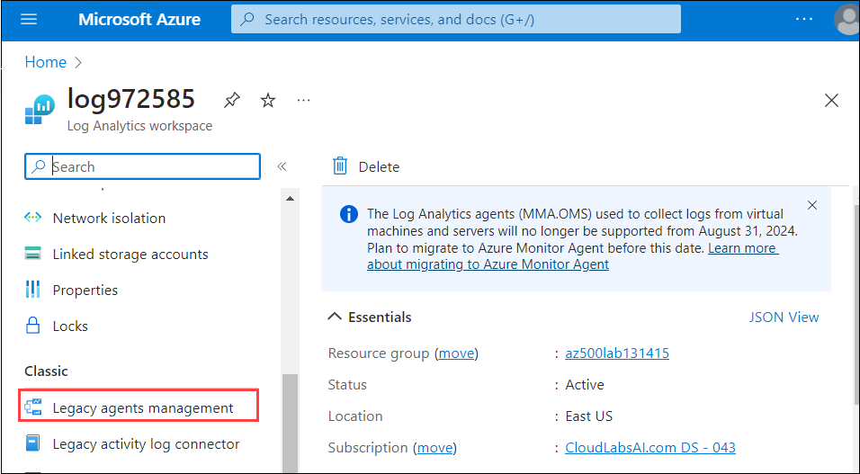
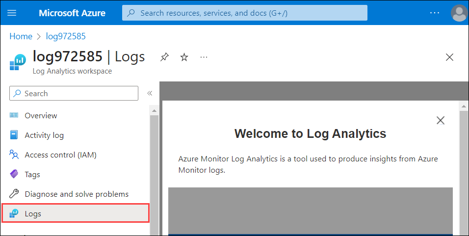

# Lab 13: Azure Monitor

## Lab scenario
You have been asked to create a proof of concept for monitoring virtual machine performance. Specifically, you want to:
- Configure a virtual machine such that telemetry and logs can be collected.
- Show what telemetry and logs can be collected.
- Show how the data can be used and queried. 

> For all the resources in this lab, we are using the **East US** region. Verify with your instructor this is the region to use for class. 

## Lab objectives
In this lab, you will complete the following exercise:
- Exercise 1: Collect data from an Azure virtual machine with Azure Monitor

## Architecture Diagram


# Exercise 1: Collect data from an Azure virtual machine with Azure Monitor

# Exercise timing: 20 minutes

In this exercise, you will complete the following tasks: 

- Task 1: Deploy an Azure virtual machine 
- Task 2: Create a Log Analytics workspace
- Task 3: Enable the Log Analytics virtual machine extension
- Task 4: Collect virtual machine event and performance data
- Task 5: View and query collected data 

## Task 1: Deploy an Azure virtual machine

1. Open the Cloud Shell by clicking the first icon in the top right of the Azure Portal. If prompted, select **PowerShell** and **Create storage**.

1. Ensure **PowerShell** is selected in the drop-down menu in the upper-left corner of the Cloud Shell pane.

1. In the PowerShell session within the Cloud Shell pane, run the following to create a resource group that will be used in this lab:
  
    ```powershell
    New-AzResourceGroup -Name AZ500LAB131415 -Location 'EastUS'
    ```

1. In the PowerShell session within the Cloud Shell pane, run the following to create a new Azure virtual machine. 

    ```powershell
    New-AzVm -ResourceGroupName "AZ500LAB131415" -Name "myVM" -Location 'EastUS' -VirtualNetworkName "myVnet" -SubnetName "mySubnet" -SecurityGroupName   "myNetworkSecurityGroup" -PublicIpAddressName "myPublicIpAddress" -OpenPorts 80,3389
    ```

1.  When prompted for credentials:

    |Setting|Value|
    |---|---|
    |User name|**localadmin**|
    |Password|**Pa55w.rd1234**|

    >**Note**: Wait for the deployment to complete. 

1. In the PowerShell session within the Cloud Shell pane, run the following to confirm that the virtual machine named **myVM** was created and its **ProvisioningState** is **Succeeded**.

    ```powershell
    Get-AzVM -Name 'myVM' -ResourceGroupName 'AZ500LAB131415' | Format-Table
    ```

1. Close the Cloud Shell pane. 

## Task 2: Create a Log Analytics workspace

In this task, you will create a Log Analytics workspace. 

1. In the Azure portal, in the **Search resources, services, and docs** text box at the top of the Azure portal page, type **Log Analytics workspaces** and press the **Enter** key.

1. On the **Log Analytics workspaces** blade, click **+ Create**.

1. On the **Basics** tab of the **Create Log Analytics workspace** blade, specify the following settings (leave others with their default values):

    |Setting|Value|
    |---|---|
    |Subscription|the name of the Azure subscription you are using in this lab|
    |Resource group|**AZ500LAB131415**|
    |Name|any valid, globally unique name|
    |Region|**(US) East US**|

1. Click **Review + create**.

1. On the **Review + create** tab of the **Create Log Analytics workspace** blade, click **Create**.

## Task 3: Enable the Log Analytics virtual machine extension

In this task, you will enable the Log Analytics virtual machine extension. This extension installs the Log Analytics agent on Windows and Linux virtual machines. This agent collects data from the virtual machine and transfers it to the Log Analytics workspace that you designate. Once the agent is installed it will be automatically upgraded ensuring you always have the latest features and fixes. 

1. In the Azure portal, navigate back to the **Log Analytics workspaces** blade, and, in the list of workspaces, click the entry representing the workspace you created in the previous task.

1. On the Log Analytics workspace blade, in the **Get started with Log Analytics** section, click the **Azure virtual machines (VMs)** entry under **Connect a data source** field.

    >**Note**: For the agent to be successfully installed, the virtual machine must be running.

1. In the list of virtual machines, locate the entry representing the Azure VM **myVM** you deployed in the first task of this exercise and note that it is listed as **Not connected**.

1. Click the **myVM** entry and then, on the **myVM** blade, click **Connect**. 

1. Wait for the virtual machine to connect to the Log Analytics workspace.

    >**Note**: This may take a few minutes. The **Status** displayed on the **myVM** blade, will change from **Connecting** to **This workspace**. 

## Task 4: Collect virtual machine event and performance data

In this task, you will configure collection of the Windows System log and several common performance counters. You will also review other sources that are available.

1. In the Azure portal, navigate back to the Log Analytics workspace you created earlier in this exercise.

1. On the Log Analytics workspace blade, in the **Classics** section, click **Legacy agents management**.

    

1. On the **Legacy agents management** blade, review the configurable settings including Windows Event Logs, Windows Performance Counters, Linux Performance Counters, IIS Logs, and Syslog. 

1. Under tab **Windows event logs**, click on **+ Add windows event log**, in the listing of event log types, select **System**.

    >**Note**: This is how you add event logs to the workspace. Other choices include, for example, **Hardware events** or **Key Management Service**.  

1. Unselect the **Information** checkbox, leaving the **Error** and **Warning** check boxes selected.

1. Click **Windows Performance Counters**, click **+ Add performance counter**, review the listing of available performance counters, and add the following:

    - Memory(\*)\Available Memory Mbytes
    - Process(\*)\\% Processor Time
    - Event Tracing for Windows\Total Memory Usage --- Non-Paged Pool
    - Event Tracing for Windows\Total Memory Usage --- Paged Pool

    >**Note**: The counters are added and configured with 60 second collection sample interval.
  
1. Now click **Apply**.

## Task 5: View and query collected data

In this task, you will run a log search on your data collection. 

1. In the Azure portal, navigate back to the Log Analytics workspace you created earlier in this exercise.

2. On the Log Analytics workspace blade, in the **General** section, click **Logs**.

     

3. If needed, close the **Welcome to Log Analysis** window. 	

4. On the **Queries** pane, within the searchbox, type **Memory and CPU usage**.
    	
5. On the **Memory and CPU usage** card, click on the **Run** button.

6. The query will automatically open in a new query tab. 

    >**Note**: Log Analytics uses the Kusto query language. You can customize the existing queries or create your own. 

    >**Note**: The results of the query you selected are automatically displayed below the query pane. To re-run the query, click **Run**.

    >**Note**: Since this virtual machine was just created, there may not be any data yet. 

    >**Note**: You have the option of displaying data in different formats. You also have the option of creating an alert rule based on the results of the query.
    
    >**Note**: You can generate some additional load on the Azure VM you deployed earlier in this lab by using the following steps:	
    
 7. Now, navigate to the Azure VM blade within the Azure portal.
 
 8. On the **Overview** page for the virtual machine, select the **Connect** button.
 
 9. On the RDP tab, select the **Download RDP File** button.
 
10. Open the RDP file that was just downloaded. When a dialog appears asking if you want to connect, select **Connect**.
 
11. Enter the username and password selected during the virtual machine provisioning process. Then select **OK**.
 
12. When the **Remote Desktop Connection** dialog appears asking if you want to connect, select **Yes**.
    
13. Within the remote session, right-click on the **Start** icon on the Task bar and select **Windows Powershell(Admin)** and Run the below commands one by one:
 	
       ```cmd	
       cmd	
       :loop	
       dir c:\ /s > SWAP	
       goto loop	
       ```	
       	
 14. Switch back to the Log Analytics blade and re-run the query. You might need to wait a few minutes for data to be collected and re-run the query again.

> **Results:** You used a Log Analytics workspace to configure data sources and query logs. 

> **Congratulations** on completing the task! Now, it's time to validate it. Here are the steps:

 - Navigate to the Lab Validation Page, from the upper right corner in the lab guide section.
 - Hit the Validate button for the corresponding task. If you receive a success message, you can proceed to the next task. 
 - If not, carefully read the error message and retry the step, following the instructions in the lab guide.
 - If you need any assistance, please contact us at labs-support@spektrasystems.com. We are available 24/7 to help you out.

**You have successfully completed the lab**

 
